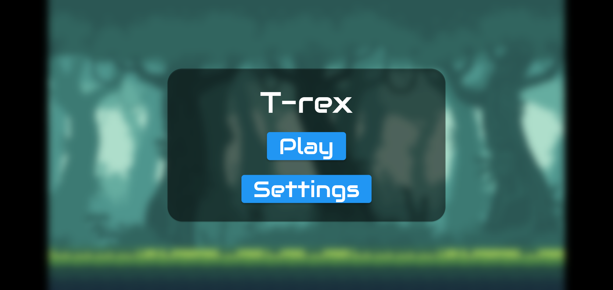
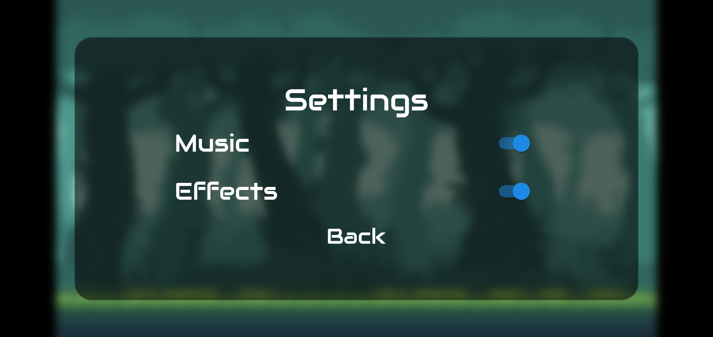
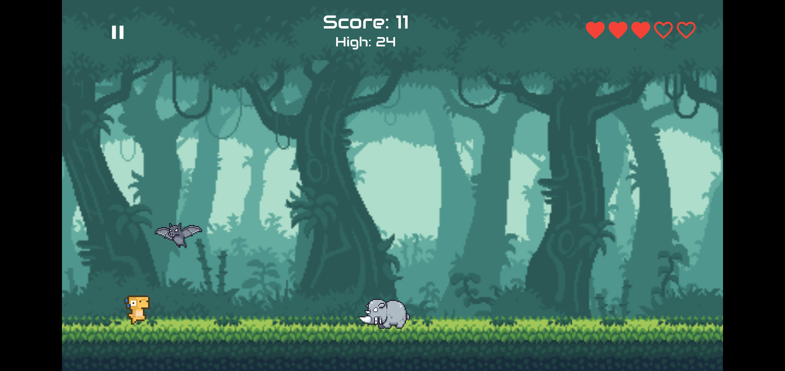

# t_rex_flame

T-rex is the 2D game where you play as a cute little t-rex using Flame engine.
All you need do it avoid being hit by enemies too many times before your score starts going up higher than ever imagined.

### Getting Started

- Flame official docs 
  - [https://docs.flame-engine.org/1.2.0/](https://docs.flame-engine.org/1.2.0/)

- Physics in platformer games 
  - [https://2dengine.com/?p=platformers](https://2dengine.com/?p=platformers)

### What you’ll learn

- 2D game structures with Flame
- The components needed to build the game (assets, audio, enemy, main character)
- How to interact among components
- How to build the menu of in-game features

### Reference

- @DevKage's YouTube series with the [Dino run tutorial](https://www.youtube.com/playlist?list=PLiZZKL9HLmWOmQgYxWHuOHOWsUUlhCCOY)

### Screenshots

|                                                                 |                                         |                                         |
| :-------------------------------------------------------------- | :-------------------------------------- | :-------------------------------------- |
|  |  |  |